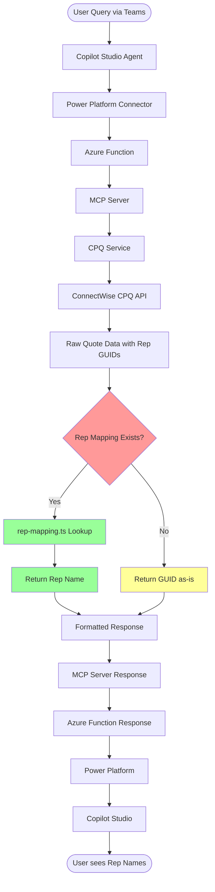
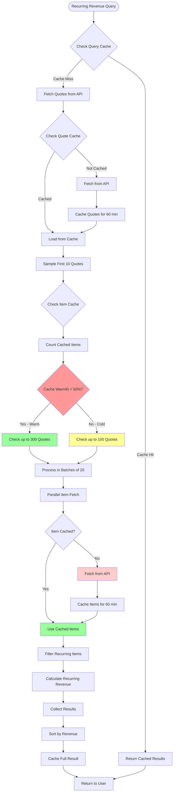
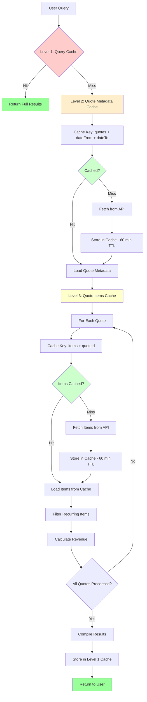
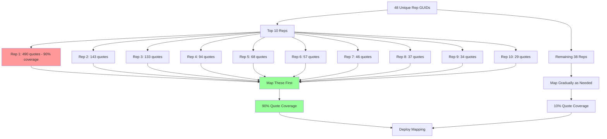

# Rep Name Mapping Flow

This diagram shows how the rep name mapping system works in the ConnectWise CPQ MCP server.

## Setup Process

## Cache Warmth Detection

## 3-Level Caching Strategy

## Priority Mapping Order

## Key Insights

### Why Manual Mapping is Required
- ConnectWise CPQ API doesn't have a user/rep lookup endpoint
- Only quote objects contain rep GUIDs (e.g., `primaryRep`, `insideRep`, `solutionsArchitect`)
- No way to programmatically resolve GUID → Name

### Cache Benefits
- **Level 1** (Query Cache): Instant responses for repeated queries (same date range + filters)
- **Level 2** (Quote Metadata): Avoid re-fetching quotes for same date range
- **Level 3** (Item Cache): Massively reduces API calls when checking multiple quotes

### Performance with Caching
- **Cold cache**: 100 quotes in ~5-8 seconds (100 API calls for items)
- **Warm cache**: 300 quotes in ~5-8 seconds (0 API calls for cached items)
- **Full cache hit**: Instant response (no API calls)

### Priority Mapping Strategy
- Focus on top 10 reps first (they appear in 90% of quotes)
- Remaining 38 reps can be added gradually
- Unmapped GUIDs display as-is until mapped
